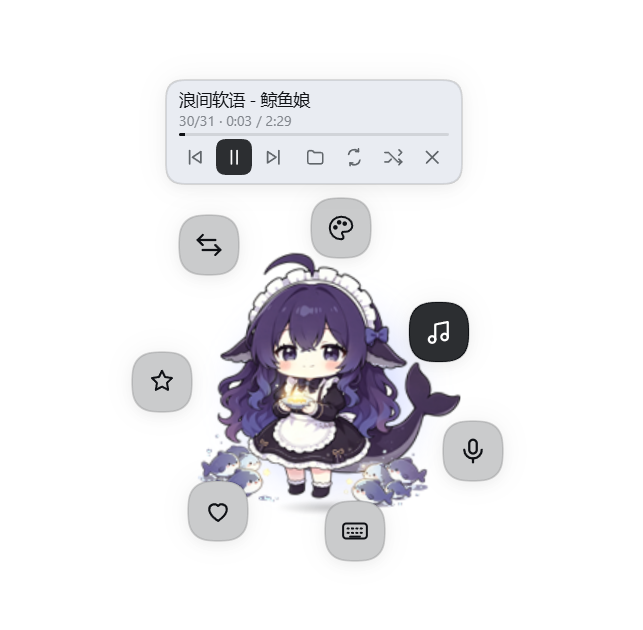

# dsh-pets — DSH 电子宠物

DSH（DeepSeek Harness）里那只浮动电子宠物的全部内容：插件源码、美术流水线、测试探针、本地语音与音乐服务、文档。
一个自包含目录，克隆下来就能改。



## 它做了什么

| 能力 | 说明 |
|---|---|
| 形象 | 三只看板：鲸鱼娘 / 机器人 / 银月；每只 5 套配色（经典、樱花、薄荷、暗夜、鎏金） |
| 表情 | 待机、点击反应、姿势切换、吃东西；轮廓与姿势帧由美术流水线标定 |
| 浮动交互 | 宠物停靠右下角，7 个动作按钮绕成环，挤不下时自动折进可展开的侧栏 |
| 语音 | 本地 STT（faster-whisper）听你说话 + 本地 TTS 出声，讲完自动送进当前会话 |
| 任务反应 | 监听会话事件：思考 / 干活 / 出错 / 干完，宠物用表情和气泡跟着反应 |
| 成就 | 8 个成就，靠抚摸、换肤、聊天、陪伴时长等统计解锁 |
| 本机音乐 | 扫描本机目录、在宠物头顶放播放机（可拖动 / 可关掉 / 可换播放目录）；mp3、m4a、flac、wav、mp4 都能真出声 |

明暗主题都有独立的墨色方案，由 `_probe/shot-contrast.cjs` 的 120 个图面把关；插件的任何渲染崩溃会
退化成右下角一个可点重试的角标，而不是整只宠物消失。

## 代码在哪：一份主源 + 一个构建副本

| 位置 | 角色 | 版本控制 |
|---|---|---|
| `dsh-pets\plugin\` | **主源**：插件全部源码（TS/TSX + CSS + 美术数据） | ✅ 本仓库 |
| `dsh-pets\` 其余 | 美术、探针、语音与音乐服务、文档 | ✅ 本仓库 |
| `…\deepseek-harness\packages\client\ui-pet\` | **构建副本**：只为编译而存在 | ❌ 随时可重建 |

副本必须在 harness 里，因为 `plugin/tsconfig.json` 继承工作区基础配置，并 project-reference 了
`ui-slots` / `ui-renderer` / `api-session-controller` 等兄弟包，**离开工作区无法编译**。

改插件的三步：

```powershell
# 1. 编辑主源   D:\ALAN\Codes\dsh-pets\plugin\src\client\…
# 2. 同步 + 构建
node sync-to-harness.mjs --build
# 3. GUI 里 Ctrl+R（没生效就 Ctrl+Shift+R）
```

| `sync-to-harness.mjs` 命令 | 作用 |
|---|---|
| `node sync-to-harness.mjs` | 同步：补新文件、覆盖改动、删除主源里已删掉的文件 |
| `node sync-to-harness.mjs --check` | 只报告漂移（缺失 / 不同 / 多余），有漂移退出码 1 |
| `node sync-to-harness.mjs --build` | 同步后重建 `lib/client.js`，并校验产物比所有主源文件都新 |

- 副本里的 `lib/` 与 `node_modules/` **永不被碰**；根目录上不认识的文件只会被提示，不会被删。
  换 checkout 就设 `$env:DSH_HARNESS='D:\其他路径\deepseek-harness'`。
- **探针读的是主源**，所以"忘了同步"只会让 GUI 落后，不会让测试给出假绿灯。
- 整个副本目录不见了也能救：`--build` 会先把源码与配置重建出来；**依赖链接不归它管**，
  新包里没有 `node_modules` 时 `tsc` 会报 `Cannot find module 'react'`，跑一次
  `cd <harness>; corepack pnpm install --no-frozen-lockfile --ignore-scripts`
  （本机 `pnpm-lock.yaml` 里没有 ui-pet 这一项，frozen 安装会拒绝）。
- `--build` 在任一构建步骤退出码非 0 时判定失败。tsdown/rollup 的 stderr 警告会让 PowerShell 报
  非零退出码，**判断成败看产物时间戳**。

## 目录地图

```
README.md                  你在这里
sync-to-harness.mjs        主源 → 构建副本的同步器（--check / --build）
plugin\                    ★ 插件主源（= harness 里那个包的全部内容，除 lib/node_modules）
  src\index.ts             宿主半边入口（空实现）
  src\client\             22 个模块 + CSS；arts\sprite-data.ts 是三只看板的条带（base64）
docs\                      architecture / art-pipeline / probe-harness / local-speech / music
pet-stt-supervisor.mjs     ★ host 插件：随宿主启停本地语音服务
pet-music.mjs              ★ host 插件：给宠物放本机音乐（扫描 + HTTP Range 流式）
local-stt-server.py        ★ 服务本体：faster-whisper 转写 + edge 语音合成
start-stt.cmd              ★ 手动启动语音服务（%~dp0 找同目录的 py）
pet.patch.yml              ★ 给未安装插件包的 harness 用的浏览器插件补丁
art\                       pipeline\ 生成脚本 · tools\ QA 工具 · sources\ 素材
                           out\ 已发布条带与接触表 · sfx\ 18 个 .m4a 音效
_probe\                    Node 探针 + 浏览器探针 + 预览生成器 + shots\（33 张截图证据）
_attic\                    已废弃的实验脚本（proto-*、crop-*、tts-eval\），仅作参考
```

`★` = 被运行中的 DSH 按绝对路径引用，**不要移动或改名**。

## 跑测试

```powershell
# Node 探针：1130 项，毫秒级，读的是主源
Get-ChildItem _probe\test-*.mjs | ForEach-Object { node $_.FullName }

# 浏览器探针：借 harness 里的 playwright + 系统 Edge
$env:NODE_PATH='D:\ALAN\Codes\deepseek-harness\apps\web\node_modules'
node _probe\shot-accent.cjs      # 42 项：强调色墨色（含像素回读）
node _probe\shot-contrast.cjs    # 120 个图面：全量对比度
node _probe\probe-mp4-path.cjs   # mp4 当音乐放（项数随盘上的 mp4 数变）
node _probe\probe-flac-path.cjs  # 15 项：flac 真出声（自带 service 实例，项数随盘上的 flac 数变）
node _probe\shot-music.cjs       # 28 项：音乐服务 + 音频总线 + 闪避（每个用例单开页面）
node _probe\shot-layout.cjs      # 87 项：真组件重叠/溢出 + 拖动 + 关闭/重开 + 换播放目录 + 崩溃面
```

当前基线：**Node 1130 + 浏览器 317，全过**。每项含义、前置条件与写新探针的约定见 `docs/probe-harness.md`，
其中三条最容易踩：

- 别和"整个工作区构建"同时跑 —— `test-live-chunks` / `test-chunk-latency` 打的是本机语音服务，
  机器被占满时会超时（不是代码坏了）。
- 播放类探针必须排除 **CORS 假象**：媒体元素在 origin 不匹配时报的是 `Format error`，
  和"编解码不支持"一模一样（见 `probe-flac-path.cjs` 的相位设计）。
- `shot-layout.cjs` 挂的是构建产物里的**真组件**：量之前等 CSS 动画结束、把宠物钉在固定位置，
  后两阶段用**真鼠标** + 真音乐服务（合成 pointerId 会让 `setPointerCapture` 抛异常，
  而"点一下才出声"必须是真的用户手势）。

## 运行接线（易踩）

- 两个 host 插件都按绝对路径写进 profile patch，**改完必须把 `?v=` 加一**，否则 DSH 拿缓存里的旧模块，
  改动看起来"没生效"：
  `name: 'file:///D:/ALAN/Codes/dsh-pets/pet-stt-supervisor.mjs?v=6'`、`pet-music.mjs?v=2`。
- `pet-stt-supervisor.mjs` 用 `new URL('./local-stt-server.py', import.meta.url)` 找服务脚本 →
  两个文件必须同目录；`start-stt.cmd` 同理用 `%~dp0`。
- 语音端口默认 8756；音乐默认 8791 并扫描 `D:\Musics`。
  两者都是**进程内**的 Node HTTP 服务（不是子进程），改配置要**重启 `dsh web`** 才生效；
  不想重启就手工跑 `node pet-music.mjs --port 8791`（客户端会连上它）。
- 插件包若没装进 harness，用 `dsh web --patch D:\ALAN\Codes\dsh-pets\pet.patch.yml` 挂浏览器半边。
- 手工构建（`--build` 内部就是这两条）：
  ```powershell
  cd D:\ALAN\Codes\deepseek-harness
  node --max-old-space-size=4096 node_modules/typescript/bin/tsc -b tsconfig.client.json
  node node_modules/tsdown/dist/run.mjs --env.DSH_BUILD_FACE client
  ```

## 我想做 X，从哪开始

| 任务 | 入口 |
|---|---|
| 改插件逻辑 / UI | `plugin\src\client\…` → `node sync-to-harness.mjs --build` → 刷新 GUI |
| 换美术 / 加姿势 | `docs/art-pipeline.md`。改完 `sprite-data.ts` **必须重测轮廓**（`_probe/dump-sheets.mjs` → `_probe/fit-ring.cjs`）并更新 `sprite.ts` 的 `FIGURE_CONTOUR` 与 `POSE_FRAMES` |
| 加皮肤 | `skin.ts` 配方 + `personas.ts`(`SKINS`/`skinKey`) + `locales.ts`(`skin.*`) + `PetWidget.module.css` 的 `[data-skin=…] { --pet-glow }` |
| 加浮动动作按钮 | `PetWidget.tsx`(`ACTION_ORDER` / `actionSpecs` / 图标)。环形只有 7 个位置，超了会自动折进 rail |
| 加成就 | `achievements.ts`(`ACHIEVEMENTS`) + `pet-types.ts`(`PetStatCounter`) + `locales.ts` |
| 改文案 | `locales.ts`（`zh` 和 `en` 都要；`PetKey` 由 `zh` 推导，漏了会编译报错） |
| 加语音指令 | `commands.ts`(`COMMANDS`) + `locales.ts`(`cmd.*`) |
| 改音乐功能 | `music.ts`（播放/歌单/持久化）+ `audioBus.ts`（混音与闪避）+ `pet-music.mjs`（服务端） |
| 改语音服务 | `local-stt-server.py` / `pet-stt-supervisor.mjs` → `docs/local-speech.md` |
| 颜色 / 对比度问题 | 先跑 `_probe/shot-contrast.cjs`，规则见 `docs/architecture.md` 的「主题与对比度不变量」 |

## 已知约束（别撞）

1. **美术只能 base64 内联**：`/plugins/` 只发 JS bundle，没有静态资源目录，所以贴图与音效都塞在
   `sprite-data.ts`（1.83 MB）/ `sfx.ts`（0.25 MB）里 —— bundle 2.24 MB 基本都是它们。
2. **`plugin/` 不能独立构建**：真要独立构建，得把 tsconfig 的 project references 换成对已发布包的依赖。
3. **主题 token 会随明暗反转**：`--dsw-alias-brand-primary` 浅色下近黑、深色下近白。
   任何"实色强调底 + 写死深色文字"都会在某个主题下变成黑底黑字，用 `--pet-on-accent`。
4. **看不到实时 GUI 的截图**：真实 GUI 要一次性随机 token，探针登不进去 → 视觉验证靠 `_probe` 里的
   静态预览页（内联真实 CSS + 真实美术）。
5. **环形容量 7**：可用弧只够 7 个 40px 按钮；折叠路径是用合成 12 个动作测的。第 8 个动作就会折进 rail。
6. **PowerShell 读 CJK**：`Get-Content -Raw` 会把 UTF-8 当 GBK，`Set-Content -Encoding utf8` 会写 BOM。
   改文件用编辑器或 Node；`.ps1` 里不要内嵌 CJK 路径（走参数传）。
7. **音乐服务默认对回环放开 CORS**（`corsOrigin: '*'`）：接 WebAudio 做分析就必须带 `crossOrigin`
   + `Access-Control-Allow-Origin`，代价是**本机任何网页都能读到你的曲目和音频字节**；
   要收紧就改成 `http://127.0.0.1:3080`。**收紧后 origin 不匹配的页面播放会报
   `MEDIA_ELEMENT_ERROR: Format error`** —— 这是 CORS 拒绝，不是解码失败，别照着"格式不支持"去查。
8. **能不能解取决于系统编解码器，不取决于扩展名**：服务端白名单（10 种）只决定"列不列出来"。
   本机实测（`_probe/probe-flac-path.cjs`）：mp3 / m4a / mp4 / wav / **flac 都真出声**
   （flac 走 `<audio>`，5.4 分钟的文件 1.2 秒内正常走带）；wma 之类 `canPlayType` 可能点头但解码大概率失败。
   失败会给出可读原因，不会转圈。
